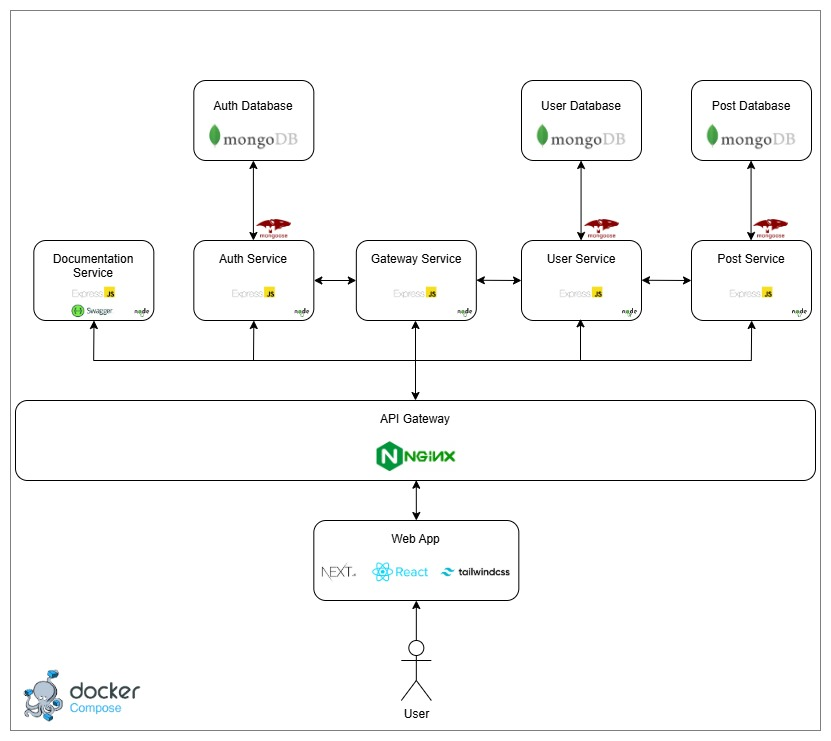
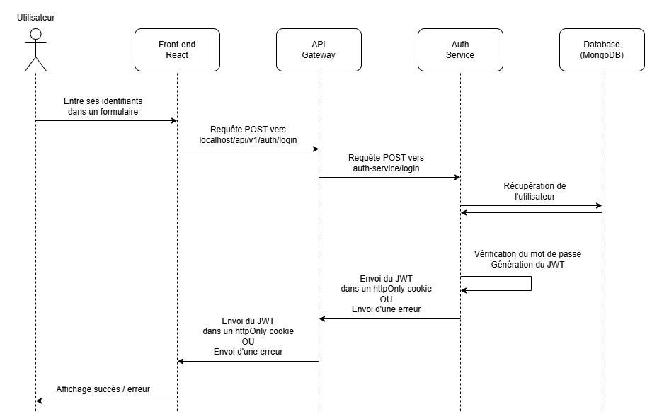

# Breezy

[Voir le raport](https://docs.google.com/document/d/10tIVinae-nB-uTsbRysJl4JLvHKc4MMFTIII2MJp91U/edit?usp=sharing)  

Breezy est une plateforme de microblogging décentralisée, pensée autour d’une architecture microservices. Elle permet à ses utilisateurs de publier, suivre, liker et interagir avec du contenu de manière fluide et évolutive.

## 📌 Table des matières

* [Fonctionnalités](#-fonctionnalités-principales)
* [Architecture](#%EF%B8%8F-architecture)
* [Diagrammes](#-diagrammes)
* [Technologies](#%EF%B8%8F-technologies)
* [Installation](#-installation)
* [Contributeurs](#-contributeurs)

---

## ✅ Fonctionnalités principales

* **Inscription et authentification sécurisée** : Création de compte, connexion avec JWT.
* **Publication de messages courts** : Jusqu’à 280 caractères, avec affichage sur le profil.
* **Fil d’actualité personnalisé** : Affichage chronologique des posts des utilisateurs suivis.
* **Interactions sociales** : Likes, commentaires, réponses à des commentaires.
* **Système de suivi** : Suivre ou être suivi par d’autres utilisateurs.
* **Profil utilisateur** : Informations de base, photo de profil, biographie, liste de publications.

---

## 🏗️ Architecture

L'application repose sur une **architecture microservices**. Chaque service est indépendant, conteneurisé avec Docker, et interagit via une API Gateway centralisée.

📌 **Schéma d’architecture :**
<p align="center">
  
</p>

---

## 🧩 Diagrammes

* 🔁 **Diagramme de séquence (connexion) :**
  <p align="center">
    
  </p>

* 🎨 **Maquette UI**
  [Voir la maquette Figma](https://www.figma.com/design/rtzkGhHuG5Wy2zHR6tJrns/Breesy?node-id=0-1&p=f&t=YGtQfWLPAKJUyOzB-0)

---

## ⚙️ Technologies

### 🧠 Back-end (Node.js & Express)

#### Technologies utilisées :

* **Node.js**
* **Express.js**
* **MongoDB**
* **Mongoose**
* **JWT (JSON Web Tokens)**

#### Sécurisation :

* Authentification JWT
* Gestion des erreurs
* CORS (Cross-Origin Resource Sharing)

#### Performance :

* Conteneurisation avec **Docker**

---

### 🎨 Front-end (React & Next.js)

#### Technologies utilisées :

* **React.js**
* **Next.js**
* **Tailwind CSS**
* **Axios**
* **React Router**

#### Réactivité & UI/UX :

* Design **mobile-first**
* Responsive
* Gestion des erreurs côté UI

#### Gestion des sessions :

* Stockage des JWT
* Redirection automatique après authentification

---

## 🚀 Installation

1. **Cloner le dépôt**  

   ```bash
   git clone https://github.com/ton-projet/breezy.git
   cd breezy
   ```

2. **Configurer les variables d’environnement**  
   Un fichier d'exemple est disponible ici :
   `frontend/breezy/.env.example`
   ➤ Copiez-le et adaptez-le selon votre configuration :

   ```bash
   cp frontend/breezy/.env.example frontend/breezy/.env
   ```

3. **Lancer l’environnement Docker**  

   ```bash
   docker-compose up --build
   ```

4. **Tester l’API**  
   La documentation Swagger est disponible à cette adresse :  
   👉 [http://localhost:8080/docs](http://localhost:8080/docs)

5. **Accéder au frontend**  
   Une fois les services démarrés, l’interface utilisateur React est accessible ici :  
   👉 [http://localhost:3000](http://localhost:3000)

---

## 👨‍💻 Contributeurs

* **Robin Devalle**
* **Loan Gayrard**
* **Simon Launay**
* **Paulin Renault**
